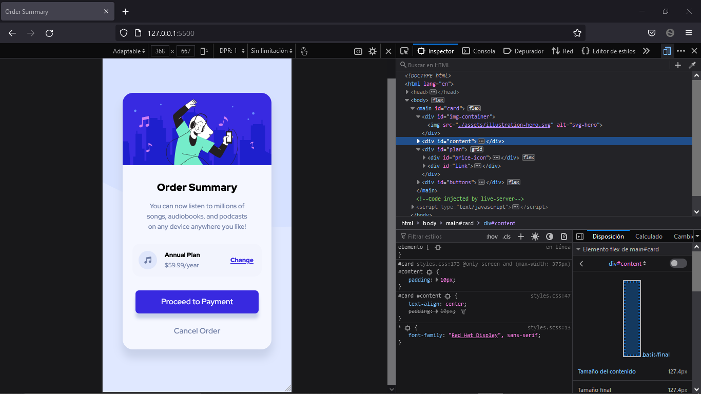

# Order summary card 

Solucion a [Order summary card challenge on Frontend Mentor](https://www.frontendmentor.io/challenges/order-summary-component-QlPmajDUj).

## Tabla de contenidos

- [Order summary card](#order-summary-card)
  - [Tabla de contenidos](#tabla-de-contenidos)
  - [Informacion general](#informacion-general)
    - [Desafios](#desafios)
    - [Screenshots](#screenshots)
    - [Links](#links)
    - [Utilice](#utilice)
    - [Que aprendi](#que-aprendi)
    - [Recursos utiles](#recursos-utiles)
  - [Author](#author)


## Informacion general

### Desafios

Los usuarios deben ser capaces de:

- Ver el diseño óptimo según el tamaño de pantalla de su dispositivo
- Ver estados de desplazamiento para elementos interactivos

### Screenshots





### Links

- Solucion URL: [https://github.com/NicolasGula/Order-summary-card](https://github.com/NicolasGula/Order-summary-card)
- Sitio URL: [https://nicolasgula.github.io/Order-summary-card/](https://nicolasgula.github.io/Order-summary-card/)

### Utilice

- HTML5
- CSS , SASS
- Flexbox
- CSS Grid
- Responsive Web Design

### Que aprendi

- Utilizar variables con SASS


```css

$pale-blue: hsl(225, 100%, 94%);
$bright-blue: hsl(245, 75%, 52%);
$very-pale-blue: hsl(225, 100%, 98%);
$veryMuch-pale-blue: hsl(230, 75%, 97%);
$desaturated-blue: hsl(224, 23%, 55%);
$desaturated-blue2: hsl(224, 43%, 85%);
$dark-blue: hsl(223, 47%, 23%);
$height: 100%;
$font-p: 12px;
```

- Anidar selectores CSS
```css
 #content {
    text-align: center;
    padding: 10px;

    h1 {
      font-size: 20px;
      font-weight: 900;
      margin-top: 15px;
    }
    p {
      font-size: $font-p;
      font-weight: 500;
      color: $desaturated-blue;
      width: 250px;
    }
  }
```
### Recursos utiles

- [SASS](https://sass-lang.com/guide) 
- [10 CSS Pro Tips](https://www.youtube.com/watch?v=Qhaz36TZG5Y&t=242s&ab_channel=Fireship) 


## Autor

- Website - [Nicolas Gula](https://www.your-site.com)

